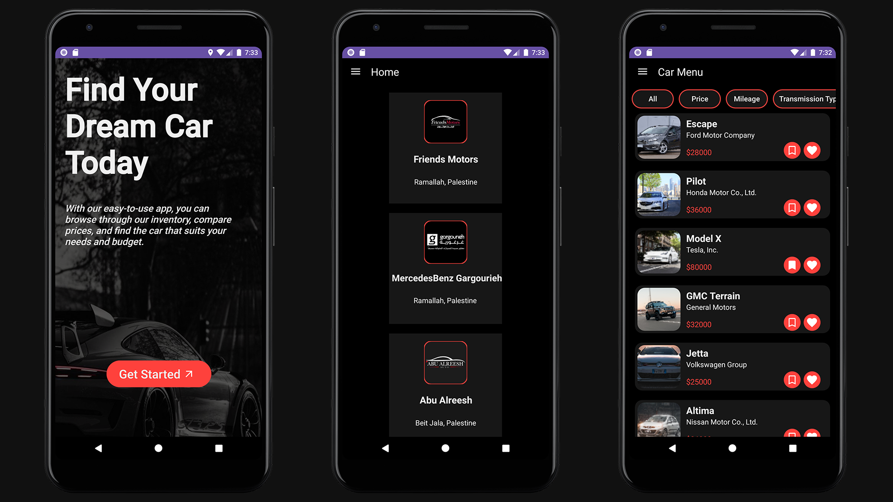

# 🚀 Car Dealer Android Application

Welcome to the **Advance Car Dealer** Android application. This app provides a seamless experience for users to explore, reserve, and interact with the car dealer's offerings.

## 🌟 Features
### 1. Introduction Layout 
-  Connect button to establish a connection to the server using REST.
-  Proceed to login and registration on successful connection.
-  Display error message on unsuccessful connection.

### 2. Login and Registration Layout 
-  Login and Sign-Up buttons.
-  "Remember Me" checkbox to save email in shared preferences.
-  Sign-Up layout with conditions for valid input.

### 3. Home Layout (Sign in as Normal Customer)
-  Navigation Drawer Activity with sections for car dealer's history, car menu, reservations, favorites, special offers, profile, call us or find us, and logout.

### 3.2 Car Menu
-  Display all car types with details using fragments.
-  Implement filters for searching by Price, Model, and Name.
-  "Add to Favorites" and "Reserve" buttons for each car.

### 3.3 Your Reservations
- 🗓 Display all reserved cars with date and time.

### 3.4 Your Favorites
-  Display favorite cars with functionality for reservations.

### 3.5 Special Offers 
-  Showcase special offers with reservation and add to favorites functionality.

### 3.6 Profile 
-  View and change personal information as per sign-up page conditions.

### 3.7 Call Us or Find Us 
-  Buttons for call, Google Maps, and Gmail functionalities.

### 3.8 Logout 
- Log out and redirect to the login page.

### 4. Home Layout (Sign in as Admin) 
-  Navigation Drawer Activity for admin with delete customers, add admin, view all reserves, and logout functionality.

### 5. Advanced Features 
-  Advanced profile information with profile picture.
-  Enhanced filtering for cars based on additional criteria.
-  User reviews and ratings for cars.
-  Push notifications for special offers and updates.

## 💻 Technologies Used
- Android Layouts (Dynamic and Static)
- Intents and Notifications (Toast messages)
- SQLite Database
- Animation (Frame and Tween)
- Fragments
- Shared Preferences
- RESTful Services

## 🚀 Getting Started
1. Clone the repository.
2. Open the project in Android Studio.
3. Set up necessary configurations.
4. Run the application on an emulator or a physical device.

## 👥 Contributors
- Nicola Abu Shaieh 👩‍💻
- Saliba Manoly👨‍💻

